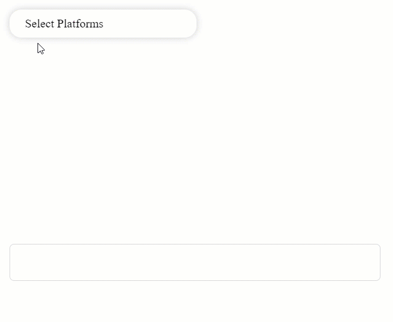

# SupperDD

Very useful react component for multi selection dropdown with filtering , 
toggle selecting all, tags outside the dropdown and custom button inside dropdown



## Installation

```bash
npm install supperdd
```

## Usage

```python
import SuperDD from 'SuperDD/SuperDD';

const Home = (props) => {
  let listData = [
    {Id: 1, Code: 'hhh', Name: 'Hello1', Discription: 'anything1'},
    {Id: 2, Code: 'ggg', Name: 'Hello2', Discription: 'anything2'},
    {Id: 3, Code: 'fff', Name: 'Hello3', Discription: 'anything3'},
    {Id: 4, Code: 'rrr', Name: 'Hello4', Discription: 'anything4'},
    {Id: 5, Code: 'nnn', Name: 'Hello5', Discription: 'anything5'},
    {Id: 6, Code: 'uuu', Name: 'Hello6', Discription: 'anything6'},
    {Id: 7, Code: 'ooo', Name: 'Hello7', Discription: 'anything7'},
    {Id: 8, Code: 'www', Name: 'Hello8', Discription: 'anything8'},
  ];

  const selectedLabelsContainer = useRef(null);

  const updateActionHandler = ()=>{};

  const cancelActionHandler = ()=>{};

  return (
      <div >
        <SuperDD
          DataList={listData}
          DisplayBy={'Code'}
          PlaceHolder={'Select Platforms'}
          ShowUpdateButton={true}
          UpdateAction={updateActionHandler}
          ShowCancelButton={true}
          CancelAction={cancelActionHandler}
          Filterable={true}
          SelectedLabelsOutsideIn={selectedLabelsContainer}
        />
      </div>
  );
};

```

## Contributing

Pull requests are welcome. For major changes, please open an issue first to discuss what you would like to change.

Please make sure to update tests as appropriate.

## License

[MIT](https://choosealicense.com/licenses/mit/)
